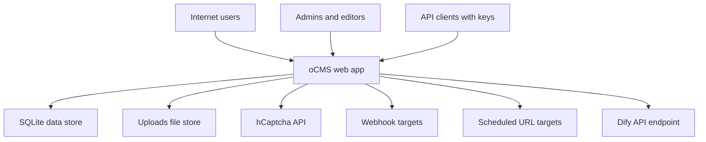

## Executive summary
The highest-risk theme is unauthenticated abuse of public runtime surfaces that proxy or persist user-controlled data, especially the enabled public embed proxy endpoints. The most material risks are cost/availability abuse of the Dify proxy, production misconfiguration that enables default seeded credentials, and data/automation side effects from unrestricted public form submissions. Core security controls around admin/API auth, CSRF, outbound SSRF hardening (webhooks/scheduler), and upload validation are generally solid, but a few high-leverage abuse paths remain.

## Scope and assumptions
In-scope paths:
- `cmd/ocms/main.go`
- `internal/**`
- `modules/**`
- `custom/modules/**`
- `docker-compose.yml`
- `.env.example`

Out-of-scope:
- Test-only behavior and unit-test fixtures except where they clarify controls
- Non-runtime local tooling scripts unless they materially affect deployment security

Validated assumptions from user:
- `editor` users are trusted.
- `embed` module is enabled in production.
- Deployment does not process/store sensitive regulated data.

Additional assumptions used for ranking:
- Internet-exposed deployment behind reverse proxy/TLS.
- Single-tenant deployment model.
- Production should run with `OCMS_DO_SEED=false`.

Open questions that could materially change ranking:
- Is WAF/CDN edge rate limiting enforced in front of public endpoints (`/embed/*`, `/forms/*`)?
- Are editor accounts protected with stronger controls (SSO/2FA/IP allowlist), despite being trusted?

## System model
### Primary components
- HTTP app server (Chi router) exposing public, auth, admin, API, and module routes (evidence: `cmd/ocms/main.go`, `run()`, route registration blocks).
- Session/auth and RBAC middleware for admin routes (evidence: `internal/session/session.go`, `internal/middleware/auth.go`).
- SQLite primary datastore via SQLC queries (evidence: `internal/store/*.sql.go`).
- Filesystem-backed uploads and static serving (evidence: `cmd/ocms/main.go`, `/uploads/*`; `internal/service/media.go`).
- Optional outbound integrations: webhook dispatcher, scheduler HTTP tasks, hCaptcha verify, embed Dify proxy (evidence: `internal/webhook/delivery.go`, `internal/scheduler/task_executor.go`, `modules/hcaptcha/verify.go`, `modules/embed/proxy.go`).

### Data flows and trust boundaries
- Internet client -> Public router (`/`, `/forms/{slug}`, `/api/v1/*`, `/embed/*`, `/health`)  
  Data: page/form input, API query params, embed chat payloads.  
  Channel: HTTP(S).  
  Security: security headers, request timeout, CSRF on form POST routes, selective auth/rate limit by route group (evidence: `cmd/ocms/main.go`, middleware stack and groups).
- Browser -> Auth/Admin routes (`/login`, `/admin/*`)  
  Data: credentials, CSRF-protected state changes, admin content/config changes.  
  Channel: HTTP(S) + session cookie.  
  Security: login rate limiting + lockout + optional hCaptcha; session renewal on login; RBAC middleware (evidence: `internal/handler/auth.go`, `internal/middleware/login_protection.go`, `internal/middleware/auth.go`, `internal/middleware/csrf.go`).
- API client -> `/api/v1` write endpoints  
  Data: page/media/taxonomy mutations, media uploads.  
  Channel: HTTP Bearer API key.  
  Security: API key hash verification, per-key permissions, global + per-key rate limits (evidence: `cmd/ocms/main.go`, `internal/middleware/api.go`).
- App server -> SQLite and uploads FS  
  Data: users/sessions/content/config/events, uploaded files.  
  Channel: local DB/filesystem.  
  Security: parameterized SQLC queries, MIME and extension checks, size limits (evidence: `internal/service/media.go`, `internal/store/*`).
- App server -> External HTTP targets (webhooks, scheduler URLs, hCaptcha, Dify)  
  Data: webhook payloads, scheduled GET requests, captcha verification payload, proxied chat traffic.  
  Channel: outbound HTTP(S).  
  Security: webhook/scheduler SSRF controls with URL validation + SSRF-safe dialer; retries and signatures for webhooks; embed proxy currently uses `http.DefaultClient` and provider URL prefix validation only (evidence: `internal/util/network.go`, `internal/webhook/delivery.go`, `internal/scheduler/validation.go`, `modules/embed/proxy.go`, `modules/embed/providers/dify.go`).

#### Diagram

## Assets and security objectives
| Asset | Why it matters | Security objective (C/I/A) |
|---|---|---|
| Admin/editor session and account integrity | Drives all privileged config/content actions | C, I |
| API keys and permission model | Grants machine write access to content/media/taxonomy | C, I |
| Content integrity (pages, media, menus, modules/config) | Defacement or malicious script injection affects visitors and trust | I, A |
| Availability of public site and admin operations | Core CMS function; abuse can degrade service | A |
| Outbound integration budgets and quotas (Dify, webhook targets) | Abuse can trigger cost and service exhaustion | A |
| Form submission data and event logs | Operational and user-provided data; can be spammed/poisoned | I, A |
| Uploads filesystem and DB growth headroom | Unbounded growth can force downtime or recovery actions | A |

## Attacker model
### Capabilities
- Anonymous internet attacker can reach public routes and module public routes.
- Authenticated API attacker with leaked/abused API key can call key-scoped write endpoints.
- Compromised trusted editor/admin account can change high-impact runtime config and module settings.
- Botnets can generate sustained request volume against public endpoints.

### Non-capabilities
- No assumed direct shell/OS access to host.
- No assumed direct DB file access unless app-layer compromise/misconfiguration occurs.
- No assumed break of Argon2id primitives or TLS cryptography.
- No multi-tenant cross-tenant threat class assumed (single-tenant assumption).

## Entry points and attack surfaces
| Surface | How reached | Trust boundary | Notes | Evidence (repo path / symbol) |
|---|---|---|---|---|
| `/embed/dify/chat-messages`, `/embed/dify/messages/{messageID}/suggested` | Public internet | Internet -> module public route -> outbound upstream | Unauthenticated proxy to upstream Dify using server-side API key | `modules/embed/module.go` `RegisterRoutes`; `modules/embed/proxy.go` |
| `/forms/{slug}` POST | Public internet | Internet -> app -> DB | Public submissions; captcha optional per form design | `cmd/ocms/main.go` form routes; `internal/handler/forms.go` `Submit` |
| `/login` POST | Public internet | Internet -> auth -> session | Login protection, lockout, optional captcha | `internal/handler/auth.go`; `internal/middleware/login_protection.go` |
| `/admin/*` mutating routes | Authenticated browser | Authenticated user -> privileged admin handlers | CSRF + RBAC; includes module admin routes for editor/admin group | `cmd/ocms/main.go` admin groups; `internal/middleware/auth.go`; `internal/module/registry.go` |
| `/api/v1/*` write routes | API key bearer | API client -> app -> DB/FS | Permission-scoped + rate limited; media upload supports multipart | `cmd/ocms/main.go` API routes; `internal/middleware/api.go`; `internal/handler/api/media.go` |
| Webhook delivery target URLs | Admin-configured then runtime async | App -> external HTTP | SSRF-safe dialer and URL validation | `internal/handler/webhooks.go` `validateWebhookForm`; `internal/webhook/delivery.go` |
| Scheduler task URLs | Admin-configured then runtime cron | App -> external HTTP | SSRF validation at save and execute time | `internal/handler/scheduler.go`; `internal/scheduler/task_executor.go`; `internal/scheduler/validation.go` |
| Initial seed path (`OCMS_DO_SEED=true`) | Deployment/runtime config | Operator config -> privileged identity creation | Creates known default credentials if enabled on fresh DB | `internal/store/seed.go`; `.env.example` |

## Top abuse paths
1. Anonymous attacker -> call public `/embed/dify/chat-messages` repeatedly -> server forwards requests with privileged Dify API key -> upstream quota/cost burn and degraded service.
2. Anonymous attacker -> automate high-rate `/forms/{slug}` submissions -> DB growth + event/webhook volume increase -> admin workflow disruption and potential availability impact.
3. Operator deploys production with `OCMS_DO_SEED=true` on fresh DB -> default admin credentials created (`admin@example.com` / known password) -> internet login takeover -> full admin compromise.
4. Attacker steals a valid API key with write permission -> uses `/api/v1` write endpoints and media upload -> content integrity loss and storage abuse.
5. Compromised trusted editor account -> modifies embed provider endpoint/settings -> proxy behavior changes and potential key exposure to attacker-controlled endpoint.
6. Compromised trusted editor/admin -> injects malicious script into page body content -> persistent browser-side attacks on site visitors.
7. Admin configures webhook to attacker endpoint (or compromised admin does so) -> continuous exfil of event payloads (including form data fields) -> silent data leakage and automation misuse.

## Threat model table
| Threat ID | Threat source | Prerequisites | Threat action | Impact | Impacted assets | Existing controls (evidence) | Gaps | Recommended mitigations | Detection ideas | Likelihood | Impact severity | Priority |
|---|---|---|---|---|---|---|---|---|---|---|---|---|
| TM-001 | Anonymous internet attacker | Public internet reachability; embed module enabled | Abuse public Dify proxy endpoints for high-volume requests using server-side API key | Upstream quota/cost exhaustion; latency/availability degradation | Outbound integration budget, service availability | Body size cap and JSON validation only ( `modules/embed/proxy.go` ) | No auth on proxy routes; no dedicated rate limit; no upstream domain/IP hardening | Require auth or signed short-lived token for embed proxy calls; enforce per-IP and global rate limits on `/embed/*`; cap concurrency and upstream timeouts; add allowlist URL validation for provider endpoints | Metrics on `/embed/*` request rate, upstream status mix, tokenless access, and per-IP anomalies; alerts on Dify usage spikes | high | high | high |
| TM-002 | Deployment/config error + opportunistic external attacker | Fresh DB init in production with seed enabled | Login with default seeded admin credentials | Full admin takeover and total integrity compromise | Admin accounts, content/config integrity, keys/webhooks/modules | Seeding is configurable and documented ( `internal/store/seed.go`, `.env.example` ) | No startup hard-fail when seed defaults are present in production | Hard-fail startup in production if `OCMS_DO_SEED=true`; require one-time randomized bootstrap password and forced rotate; deployment policy checks | Startup audit event when seed runs; alert if default admin email exists in production | medium | high | high |
| TM-003 | Anonymous botnet attacker | Public form endpoint(s) exposed | High-volume spam submissions to `/forms/{slug}` | DB/log/event noise, possible webhook flood, operational DoS | Availability, form data quality, event pipeline | CSRF on form routes; optional captcha via hook; request timeout ( `cmd/ocms/main.go`, `internal/handler/forms.go` ) | No default per-IP rate limit on public form submission path | Add dedicated rate limiter for form submissions; enforce optional captcha policy for public forms by default; add max submissions per IP/window and payload size quotas | Monitor submission rate per form/IP, error ratios, and webhook queue depth | high | medium | high |
| TM-004 | API key thief / compromised integration | Leaked active API key with write permission | Use `/api/v1` write endpoints to modify/delete content or upload files | Content tampering and storage misuse | API keys, content integrity, storage availability | Argon2 key hashing, permission checks, global+per-key rate limit ( `internal/middleware/api.go`, `internal/model/api_key.go` ) | No IP allowlist/scoping for keys; limited key anomaly detection | Add optional key IP CIDR allowlists; support narrower scoped keys and shorter expirations; implement key rotation guidance + revoke-on-anomaly automation | Alert on unusual key geo/IP changes, burst write patterns, and atypical endpoint mix | medium | medium | medium |
| TM-005 | Compromised trusted editor/admin | Trusted account compromise | Change embed provider endpoint to attacker-controlled host; proxy forwards server key to attacker endpoint | Secret disclosure and controlled outbound behavior | Integration secrets, integration integrity | Admin route auth + module active checks ( `cmd/ocms/main.go`, `internal/module/registry.go` ) | Provider validation only checks `http(s)` prefix ( `modules/embed/providers/dify.go` ); no SSRF-safe dialer in embed proxy | Apply `ValidateWebhookURL`-style endpoint validation for embed provider URLs; use SSRF-safe transport in embed proxy; restrict embed settings changes to admin-only if desired | Audit log + alert on embed endpoint changes and toggles; config drift detection | medium | high | medium |
| TM-006 | Compromised trusted content author | Editor/admin session control | Inject active script into page body content that is rendered to visitors | Persistent client-side abuse of visitors; reputational damage | Content integrity, visitor trust | RBAC and login controls; CSP headers ( `internal/middleware/security.go` ) | Page body is rendered as trusted HTML (`template.HTML`) by design ( `internal/handler/frontend.go` ) | For high-assurance deployments, offer optional HTML sanitizer mode for page body or script tag restrictions; enforce stronger editor account protections | Detect anomalous inline script patterns in published pages; content integrity diff alerts | medium | medium | medium |
| TM-007 | Malicious/compromised webhook operator endpoint | Admin-configured webhook present | Receive and retain webhook payloads containing operational/user-submitted data | Data leakage outside intended boundary | Form/event payload confidentiality, integration trust | URL validation + SSRF-safe dialer + HMAC signatures + retries ( `internal/handler/webhooks.go`, `internal/webhook/delivery.go` ) | No payload field-level redaction policies by event type | Add webhook event payload minimization/redaction options (especially form data); least-privilege event subscriptions by default | Alert on newly created external webhook domains and sudden delivery destination changes | medium | medium | medium |

## Criticality calibration
For this repository and context (internet-exposed CMS, no regulated data, single-tenant), priority levels are calibrated as follows:

- critical: direct unauthenticated full admin compromise or pre-auth remote code execution class issue.  
  Examples: production default credential takeover; auth bypass on `/admin/*`; pre-auth code execution in upload/parser path.
- high: unauthenticated or low-friction paths that materially damage availability, cost, or site integrity.  
  Examples: embed proxy abuse causing quota exhaustion; mass form spam causing operational degradation; wide API key abuse with write permissions.
- medium: requires stronger preconditions (trusted-account compromise/misconfig) but still meaningful impact.  
  Examples: compromised editor injects malicious page script; malicious webhook destination receives business data; API key abuse constrained by permission/rate limit.
- low: limited impact or already strongly mitigated by layered controls.  
  Examples: blocked scheduler/webhook SSRF attempts due URL validation + SSRF-safe transport; low-sensitivity health status exposure for unauthenticated callers.

## Focus paths for security review
| Path | Why it matters | Related Threat IDs |
|---|---|---|
| `modules/embed/proxy.go` | Public unauthenticated proxy and outbound request handling | TM-001, TM-005 |
| `modules/embed/module.go` | Exposes public embed routes and admin settings routes | TM-001, TM-005 |
| `modules/embed/providers/dify.go` | Endpoint/API-key settings validation depth for embed provider | TM-005 |
| `cmd/ocms/main.go` | Global route exposure and middleware composition by route group | TM-001, TM-003, TM-004 |
| `internal/handler/forms.go` | Public submission ingestion, validation, and persistence | TM-003 |
| `internal/store/seed.go` | Default bootstrap credential creation logic | TM-002 |
| `internal/middleware/api.go` | API key authn/z and rate-limiting controls | TM-004 |
| `internal/handler/api/media.go` | API media upload entrypoint and body size handling | TM-004 |
| `internal/webhook/delivery.go` | Outbound delivery transport and retry behavior | TM-007 |
| `internal/handler/webhooks.go` | Webhook URL and event/header validation path | TM-007 |
| `internal/scheduler/task_executor.go` | Outbound scheduler execution path and SSRF resistance | low residual |
| `internal/scheduler/validation.go` | URL safety checks for scheduled task targets | low residual |
| `internal/handler/frontend.go` | Trust boundary where authored HTML is rendered to visitors | TM-006 |
| `internal/middleware/security.go` | CSP/header posture and browser-side risk reduction | TM-006 |
